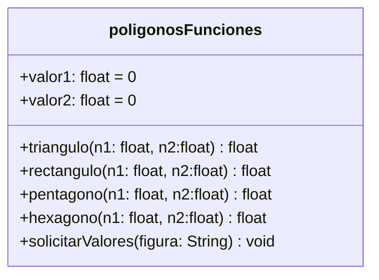

# Diagrama de clase



# Diagrama de flujo
```mermaid
graph TB
    inicio((Inicio))-->Figura
    Figura[/Figura/] -->triangulo
    triangulo{Triangulo?}
    triangulo-->|Sí| CalcularTriangulo -->resultadoTriangulo
    triangulo-->|No| rectangulo
    resultadoTriangulo[\ResultadoTriangulo\]-->fin
    rectangulo{Rectangulo?}-->|Sí| CalcularRectangulo -->resultadoRectangulo
    resultadoRectangulo[\ResultadoRectangulo\]-->fin
    rectangulo-->|No| pentagono
    pentagono{Pentagono?}-->|Sí| CalcularPentagono-->resultadoPentagono
    resultadoPentagono[\ResultadoPentagono\]
    pentagono-->|No| hexagono
    hexagono{Hexagono?} -->|No| valida
    hexagono{Hexagono?} -->|Sí| CalcularHexagono-->fin
    valida[\IntroduzcaFiguraValida\]-->fin
    
    
   
    
    fin((Fin))